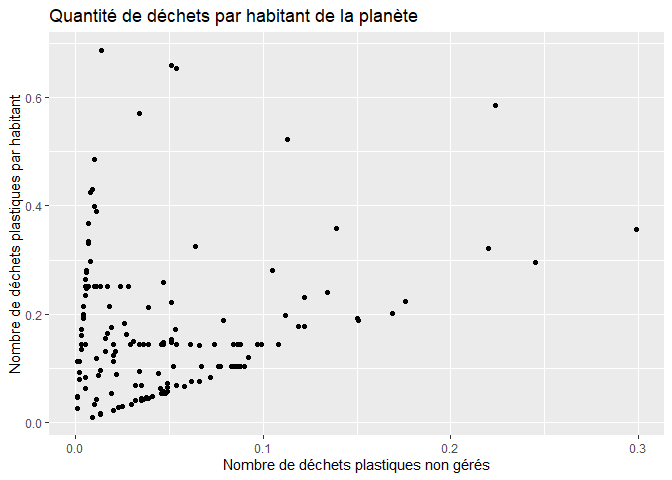

Lab 02 - Plastic waste
================
Alexanne Grondin
20 septembre 2025

## Chargement des packages et des données

``` r
library(tidyverse) 
```

``` r
plastic_waste <- read_csv("data/plastic-waste.csv")
```

Commençons par filtrer les données pour retirer le point représenté par
Trinité et Tobago (TTO) qui est un outlier.

``` r
plastic_waste <- plastic_waste %>%
  filter(plastic_waste_per_cap < 3.5)
```

## Exercices

### Exercise 1

``` r
ggplot(plastic_waste, aes(x = plastic_waste_per_cap)) +
  geom_histogram(binwidth = 0.2) +
  facet_wrap( ~ continent, ncol = 3) +
 labs(title = "Quantité de déchets par habitant de la planète", subtitle = "Selon le continent", x = "Nombre de déchets plastiques par habitant",y = "Nombre de pays")
```

<!-- -->

Nous pouvons dire que l’Amérique du Sud semble être le continent qui
produit le moins de déchets plastiques. À l’inverse, l’Amérique du Nord
semble être celui qui en produit le plus.

### Exercise 2

``` r
ggplot(plastic_waste, aes(x = plastic_waste_per_cap)) +
  geom_density() +
   labs(title = "Quantité de déchets par habitant de la planète", x = "Nombre de déchets plastiques par habitant",y = "Densité")
```

<!-- -->

``` r
ggplot(plastic_waste, aes(x = plastic_waste_per_cap, color =  continent)) +
  geom_density(adjust = 1) +
   labs(title = "Quantité de déchets par habitant de la planète", subtitle = "Selon le continent", x = "Nombre de déchets plastiques par habitant",y = "Densité")
```

<!-- -->

``` r
ggplot(plastic_waste, aes(x = plastic_waste_per_cap, color = continent, fill = continent)) +
  geom_density(adjust = 1) +
  labs(title = "Quantité de déchets par habitant de la planète", subtitle = "Selon le continent", x = "Nombre de déchets plastiques par habitant",y = "Densité")
```

<!-- -->

``` r
ggplot(plastic_waste, aes(x = plastic_waste_per_cap, color =  continent, fill = continent)) +
    geom_density(adjust = 1, alpha = 0.25) +
   labs(title = "Quantité de déchets par habitant de la planète", subtitle = "Selon le continent", x = "Nombre de déchets plastiques par habitant",y = "Densité")
```

<!-- -->

C’est parce que la catégorie Aesthetics comprend tout ce qui est
directement lié spécifiquement aux variables. La coloration des droites
dépend d’une variable, dans ce cas-ci, elle représente directement les
continents. Geom_density gère quant à elle le type de graphique et les
modifications qu’on peut y apporter sans changer nos variables
dépendantes et indépendantes. L’opactié (alpha) est un paramètre qui ne
dépend d’aucune variable et se gère donc avec ce code.

### Exercise 3

Boxplot:

``` r
ggplot(plastic_waste, aes(x = continent, y = plastic_waste_per_cap)) +
  geom_boxplot() +
labs(title = "Quantité de déchets par habitant de la planète", subtitle = "Selon le continent", x = "Continent",y = "Nombre de déchets plastiques par habitant")
```

<!-- -->

Violin plot:

``` r
ggplot(plastic_waste, aes(x = continent, y = plastic_waste_per_cap)) +
  geom_violin() +
labs(title = "Quantité de déchets par habitant de la planète", subtitle = "Selon le continent", x = "Continent",y = "Nombre de déchets plastiques par habitant")
```

<!-- -->

Les violin plot donnent un aperçu de la densité de pays (du nombre
approximatif de variable x par “tranche” de y). Par exemple, la section
plus vaste du violin plot montre qu’il y a plus de pays pour une telle
valeur de y. À l’inverse des blox plots, qui ne montrent pas de
variation en raison de leur forme.

### Exercise 4

``` r
ggplot(plastic_waste, aes(x = mismanaged_plastic_waste_per_cap, y = plastic_waste_per_cap)) +
geom_point() +
labs(title = "Quantité de déchets par habitant de la planète", x = "Nombre de déchets plastiques non gérés",y = "Nombre de déchets plastiques par habitant")
```

<!-- -->

``` r
ggplot(plastic_waste, aes(x = mismanaged_plastic_waste_per_cap, y = plastic_waste_per_cap, color = continent)) +
geom_point() +
  labs(title = "Quantité de déchets par habitant de la planète", subtitle = "Selon le continent", x = "Nombre de déchets plastiques non gérés",y = "Nombre de déchets plastiques par habitant")
```

<!-- -->

Il semble y avoir deux corrélations prédominantes. La première où la
quantité de déchets plastiques non gérés augmente à peine malgré le
nombre de déchets plastiques par habitant, et la seconde pour laquelle
le nombre de déchets plastiques non gérés augmente presque
proportionnellement avec le nombre de déchets plastiques par habitant.

En colorant les points selon le continent, on remarque deux tendance.
Les pays d’Europe forment majoritairement la première relation décrite
plus haut et les pays d’Afrique et d’Océanie forment la seconde.

### Exercise 5

``` r
ggplot(plastic_waste, aes(x = plastic_waste_per_cap, y = total_pop)) +
geom_point() +
labs(title = "Quantité de déchets par habitant de la planète", y = "Population totale",x = "Nombre de déchets plastiques par habitant")
```

    ## Warning: Removed 10 rows containing missing values or values outside the scale range
    ## (`geom_point()`).

<!-- -->

``` r
ggplot(plastic_waste, aes(x = plastic_waste_per_cap, y = coastal_pop)) +
    geom_point() +
  labs(title = "Quantité de déchets par habitant de la planète", subtitle = "Pour les habitants côtiers", y = "Population côtière",x = "Nombre de déchets plastiques par habitant")
```

<!-- -->

Non, les deux graphiques se ressemblent beaucoup et semblent
globablement comporter les mêmes tendances. Le fait qu’un habitant vive
sur une côte ou non ne semble donc pas avoir un gros impact sur la
quantité de déchets plastiques.

## Conclusion

Recréez la visualisation:

``` r
plastic_waste_coastal <- plastic_waste %>% 
  mutate(coastal_pop_prop = coastal_pop / total_pop) %>%
  filter(plastic_waste_per_cap < 3) 
```

``` r
ggplot(plastic_waste_coastal,
       aes(x = coastal_pop_prop, y = plastic_waste_per_cap, color = continent)) +
  geom_point() +
  stat_smooth(aes(group = 1)) +
  labs(title = "Quantité de déchets plastiques vs Proportion de la population côtière", subtitle = "Selon le continent", x = "Proportion de la population côtière",y = "Nombre de déchets plastiques par habitants")
```

    ## `geom_smooth()` using method = 'loess' and formula = 'y ~ x'

    ## Warning: Removed 10 rows containing non-finite outside the scale range
    ## (`stat_smooth()`).

    ## Warning: The following aesthetics were dropped during statistical transformation:
    ## colour.
    ## ℹ This can happen when ggplot fails to infer the correct grouping structure in
    ##   the data.
    ## ℹ Did you forget to specify a `group` aesthetic or to convert a numerical
    ##   variable into a factor?

    ## Warning: Removed 10 rows containing missing values or values outside the scale range
    ## (`geom_point()`).

<!-- -->

Il ne semble pas y avoir de corrélation très serrée entre ces deux
variables. En revanche, avec la couleur, on peut remarquer que les
points spécifiques à certains continents comme l’Afrique semblent plus
serrés entre eux que ne l’est le nuage de points dans son ensemble.
